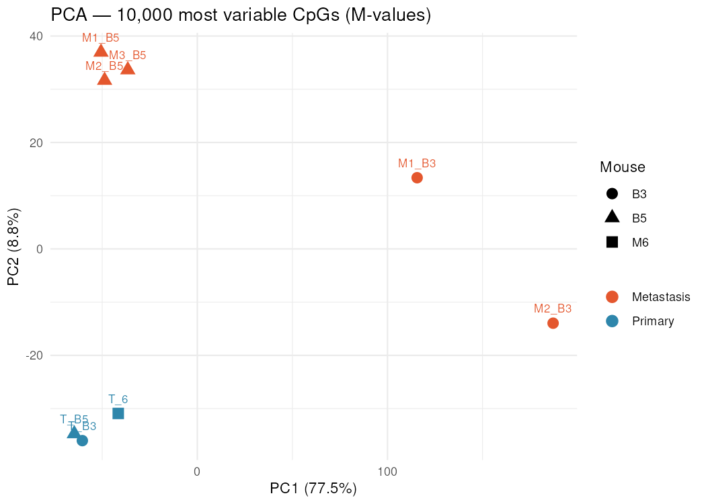
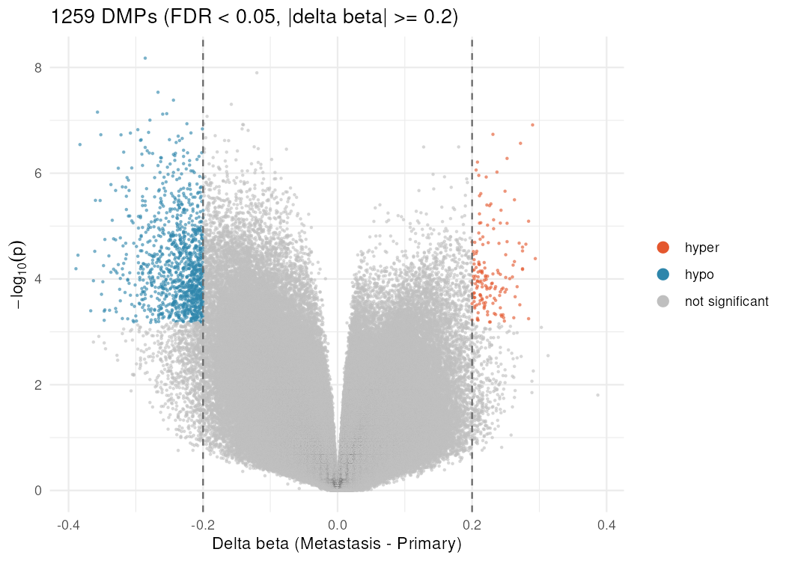
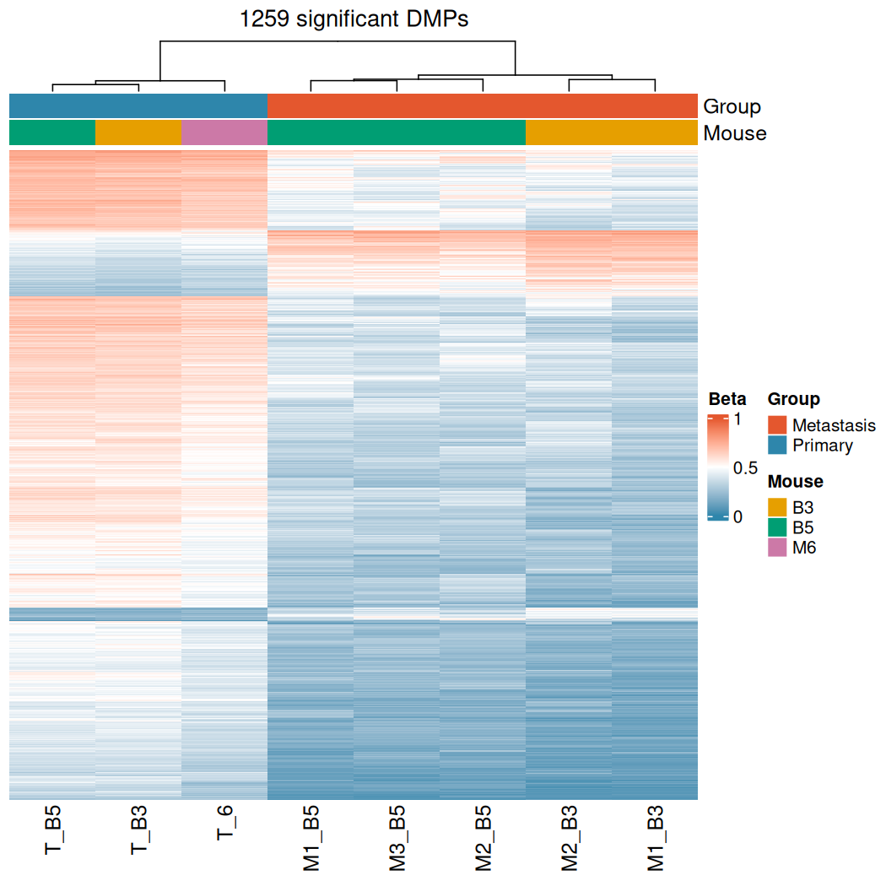

# methylation-arrays

Reproducible analysis of Illumina Infinium DNA methylation arrays (EPIC / EPICv2) with R and Bioconductor, packaged in a Docker container: from raw IDAT files to differentially methylated CpGs and publication-ready figures.

## Example dataset

The pipeline is demonstrated on [GSE245203](https://www.ncbi.nlm.nih.gov/geo/query/acc.cgi?acc=GSE245203): EPIC (v1) methylation profiles of **3 primary tumors and 5 metastases** from a spontaneous metastasis mouse model of Ewing sarcoma (human A673 cells), published in:

> Chicon-Bosch M, *et al.* Multi-omics profiling reveals key factors involved in Ewing sarcoma metastasis. *Molecular Oncology* (2025). [doi:10.1002/1878-0261.13788](https://doi.org/10.1002/1878-0261.13788)

Metastases come from the same mouse as their primary tumor, so the samples are not independent. The differential methylation model accounts for this by treating the mouse as a blocking factor.

| Mouse | Primary tumor | Metastases |
|---|---|---|
| M6 | 1 | 0 |
| B3 | 1 | 2 |
| B5 | 1 | 3 |

## Pipeline

| Step | Script | What it does |
|---|---|---|
| 0 | `00_download_data.R` | Downloads the raw IDATs from GEO (retries, discards truncated downloads) |
| 1 | `01_qc.R` | Detection p-values per sample and probe, intensity QC, removal of failed samples |
| 2 | `02_normalization.R` | Stratified quantile normalization (`minfi::preprocessQuantile`) and probe filtering |
| 3 | `03_dmp.R` | Differentially methylated positions with `limma` (M-values, mouse as blocking factor) |
| 4 | `04_figures.R` | PCA, volcano plot and heatmap |

All thresholds live in [`config/config.yml`](config/config.yml), so the same code runs on another dataset by editing the config and the sample sheet only.

## Quick start

Requirements: [Docker](https://docs.docker.com/get-docker/) and ~2.5 GB of disk space.

```bash
git clone https://github.com/NicoCosta4/methylation-arrays.git
cd methylation-arrays

# Build the image (R 4.6 + Bioconductor 3.23 + all packages)
docker build -t methylation-arrays .

# Run the whole pipeline (~3 min on a laptop, plus the ~280 MB download)
for step in 00_download_data 01_qc 02_normalization 03_dmp 04_figures; do
  docker run --rm -v "$PWD":/project methylation-arrays Rscript scripts/$step.R
done
```

Results are written to `results/` (tables and figures) and `results/rds/` (intermediate R objects, not versioned).

## Results

**Quality control.** All 8 samples pass (mean detection p-value < 0.001, < 0.2% failed probes). Three samples fall below minfi's indicative median-intensity cutoff, but were kept given their excellent detection p-values; normalization removes the intensity differences ([QC figures](results/figures/)).

**Probe filtering** ([table](results/tables/02_probe_filtering.csv)):

| Filter | Removed | Remaining |
|---|---:|---:|
| Probes after normalization | — | 865,859 |
| Detection p ≥ 0.01 in any sample | 2,186 | 863,673 |
| Non-CpG probes (ch.*) | 2,931 | 860,742 |
| Sex chromosomes | 19,102 | 841,640 |
| SNP at CpG or extension site | 29,710 | 811,930 |
| Cross-reactive probes | 39,370 | **772,560** |

**Differential methylation.** 1,259 DMPs (FDR < 0.05, |Δβ| ≥ 0.2) between metastases and primary tumors, mostly **hypomethylated in metastases** ([full table](results/tables/03_dmp_significant.csv)):

| Region | Hypermethylated | Hypomethylated |
|---|---:|---:|
| Promoter | 29 | 479 |
| Gene body | 84 | 307 |
| Intergenic | 42 | 318 |

The estimated within-mouse correlation was low (0.039), so blocking by mouse barely changes the results here, but the model stays correct for the study design.

| PCA (10,000 most variable CpGs) | Volcano plot |
|---|---|
|  |  |



Primary tumors cluster tightly, while metastases separate from them and group by mouse of origin; the metastases from mouse B3 are the most divergent.

## Methodological choices

- **Statistics on M-values, effect sizes on β-values.** M-values have better variance properties for linear models ([Du *et al.*, 2010](https://doi.org/10.1186/1471-2105-11-587)); Δβ is reported because it is directly interpretable.
- **Mouse as a blocking factor** (`limma::duplicateCorrelation`), estimated on a random subset of 50,000 CpGs.
- **Multiple-testing correction** (Benjamini–Hochberg FDR) combined with a minimum effect size.
- **Cross-reactive probes removed** using the lists of Chen *et al.* (2013) and Pidsley *et al.* (2016), versioned in [`reference/`](reference/) so the pipeline runs offline.

## Reproducibility

The Docker image pins R 4.6.1 and Bioconductor 3.23. Rebuilding the image after changing its dependencies and rerunning the full pipeline produced byte-identical result tables.

## Repository structure

```
├── Dockerfile                  # pinned R/Bioconductor environment
├── docker/install_packages.R   # package list; the build fails if any is missing
├── config/
│   ├── config.yml              # all analysis parameters
│   └── samplesheet.csv         # samples, array positions, groups and mice
├── reference/                  # cross-reactive probe list (+ sources)
├── scripts/                    # one script per pipeline step
└── results/
    ├── figures/
    └── tables/
```

## License

[MIT](LICENSE)
